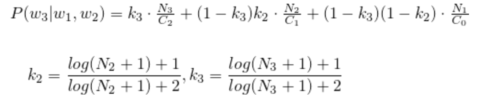

# DistributedSystems2

## By
Eran Krauss
Nevo Strauss

## Introduction
In this assignment you will generate a knowledge-base for Hebrew word-prediction system, based on
Google 3-Gram Hebrew dataset, using Amazon Elastic Map-Reduce (EMR). The produced
knowledge-base indicates for each pair of words the probability of their possible next words. In
addition, you should examine the quality of your algorithm according to statistic measures and manual
analysis.

## Goal
The goal is to calculate the probability of each trigram (w1,w2,w3) found in the corpus:  Hebrew 3-Gram dataset of [Google Books Ngrams](https://aws.amazon.com/datasets/google-books-ngrams/).

The output of the system is a list of word trigrams (w1,w2,w3) and their conditional probabilities (P(w3|w1,w2))).
The list will be ordered: (1) by w1w2, ascending; (2) by the probability for w3, descending.

For example:
```
רדיו ־ אקטיביים	0.22877829318843024
רדיו ־ טרנזיסטור	0.2050140769911889
רדיו ־ טייפ	0.14986321352502796
רדיו או טלוויזיה	0.8111798155584898
רדיו וטלוויזיה	0.3718603470799227
```

## Instruction
clone and run the Main.jar

## Description
The program is built with6 steps and main class:

## Main Class
* Creates all the AWS connections (EMR, S3, EC2 etc..),
* Create auxiliary buckets
* Uploads all the jar files to S3
* Configs all the EMR steps

### Step1
Step1's input is the Google 1-gram corpus.
For each line in the input, the Mapper class creates a line with the word and its occurrence, and another line with  * (a unique key) and the same occurrence.
In the reducer , we combine all the occurrences by key. 
* Note that we also sum up all the occurrences with * in order to get the sum of all the words occurrences.

### Step2
Step2's input is the Google 2-gram corpus.
For each line from the input ,the Mapper class creates a line with the 2 words and their occurrences.
In the reducer , we combine all the occurrences by key.

### Step3
Step3's input is the Google 3-gram corpus.
For each line from the input ,the Mapper it creates a line with the 3 words and their occurrences.
In the reducer , we combine all the occurrences by key.

### Step4
Step4's input is the outputs of step2 and step3.
* In the Mapper Class:

If the line is from the output of Step2, it's a pair and the key will be the pair and the value is the occurrence.
If the line is from the output of Step3 , it's 3 words , so we will split it into 2 pairs.
Pair1 is the first and second words. the key is the pair and the value is the 3 words and their occurrence.
Pair2 is the second and third words. the key is the pair and the value is the 3 words and their occurrence.

* In the Reducer Class:

The 3 words will become the key , and the value will be the pair and it's occurrence.

### Step5
Step5's input is the output of step3 and step4.

* In the Mapper Class:

If the line is from the output of step3, the key is the 3 words and the value is the occurrence.
If the line is from the output of step4 , the key is the 3 words and the value is the pair and it's occurrence.

* In the Reducer Class:

The setup function is the first to be triggered.
The setup function loads from the hdfs all step1 output.
After this , we calculate the probability of the appearance of 3 words in the text.
The calculation is like 
<a href="https://dl.acm.org/doi/10.3115/1034678.1034712"> this.</a>
or more simplify: 

Where:
* N1 is the number of times w3 occurs.
* N2 is the number of times sequence (w2,w3) occurs.
* N3 is the number of times sequence (w1,w2,w3) occurs.
* C0 is the total number of word instances in the corpus.
* C1 is the number of times w2 occurs.
* C2 is the number of times sequence (w1,w2) occurs.

All the variables are taken from the values in the context.
* N1 - from the map that we initialized in the setup
* N2 - if the value is pair , we take the occurrence
* N3 - if the value is the occurrence it takes it
* C0 - calculate in the setup , if it * take the occurence
* C1 - from the map that we initialized in the setup
* C2 - take the occurrence from the value if its the correct w1

then , the key is the 3 words and the value is the probability

### Step6
Step6's input is the output of step5.
We compare with the CompareClass two strings , if the first two words are the same , we return the one which has the higher probability.
In the Mapper Class, the output is the same key and value sorted by descending value of the probability.

## Statistics

### Step1

#### Without local aggregation
```
Map input records=44400490
Map output records=88800536
Map output bytes=860143841
Combine input records=0
Combine output records=0
Reduce input records=88800536
Reduce output records=645262
```

#### With local aggregation
```
Map input records=44400490
Map output records=88800536
Map output bytes=860143841
Combine input records=88800536
Combine output records=645290
Reduce input records=645290
Reduce output records=645262
```

### Step2

#### Without local aggregation
```
Map input records=252069581
Map output records=233334882
Map output bytes=4707102779
Combine input records=0
Combine output records=0
Reduce input records=233334882
Reduce output records=4758874
```  
#### With local aggregation
```
Map input records=252069581
Map output records=233334882
Map output bytes=4707102779
Combine input records=233334882
Combine output records=4758948
Reduce input records=4758948
Reduce output records=4758874
```

### Step3

#### Without local aggregation
```
Map input records=163471963
Map output records=119255104
Map output bytes=2903980410
Combine input records=0
Combine output records=0
Reduce input records=119255104
Reduce output records=2803960
```
#### With local aggregation
```
Map input records=163471963
Map output records=119255104
Map output bytes=2903980410
Combine input records=119255104
Combine output records=2804000
Reduce input records=2804000
Reduce output records=2803960
```

### Step4

#### Without local aggregation
```
Map input records=7562834
Map output records=10366794
Map output bytes=425801365
Combine input records=0
Combine output records=0
Reduce input records=10366794
Reduce output records=5163654
```

### Step5

#### Without local aggregation
```
Map input records=7967614
Map output records=7967614
Map output bytes=296368509
Combine input records=0
Combine output records=0
Reduce input records=7967614
Reduce output records=2972416
```

### Step6

#### Without local aggregation
```
Map input records=2972416
Map output records=2972416
Map output bytes=131663962
Combine input records=0
Combine output records=0
Reduce input records=2972416
Reduce output records=2972416
 ```

## Analysis
example 1:

The pair: "זה תפקיד"
```
זה תפקיד של	0.10145341862029325
זה תפקיד חשוב	0.10052467106815949
זה תפקיד קל	0.09381888562903047
זה תפקיד קשה	0.09149434576985435
זה תפקיד לא	0.0578415570093515

```

example 2:

The pair: "מצבה הכלכלי"
```
מצבה הכלכלי של	0.1582587717199171
מצבה הכלכלי .	0.08264572208434964
מצבה הכלכלי הקשה	0.07364508454010353
מצבה הכלכלי והחברתי	0.050985354153567725
מצבה הכלכלי היה	0.04146616751652567
מצבה הכללי של	0.8931894009667585

```

example 3:

The pair: "איסור על"
```
איסור על הגברא	0.010172490251773027
איסור על העברת	0.009791433435650396
איסור על אדם	0.008803559898784234
איסור על ידו	0.008800793228217505
איסור על פעילות	0.007851450226751894

```

example 4:

The pair: "לא הייתי"
```
לא הייתי בטוהה	8.008828984730412E-4
לא הייתי נכנסת	7.620157537484494E-4
לא הייתי חלק	7.377419532049636E-4
לא הייתי מרוכז	7.350632533123234E-4
לא הייתי פוגשת	6.829230180432766E-4

```

example 5:

The pair: "מעט יותר"
```
מעט יותר מאוחר	0.01754724700357172
מעט יותר משנה	0.017371054118294826
מעט יותר אל	0.01593480637095891
מעט יותר (	0.013963331687860875
מעט יותר זמן	0.011563598238293076

```

example 6:

The pair: "של מי"
```
של מי ורדים	0.001577270095182764
של מי היד	0.0013589597579876456
של מי שנחשבו	0.0013549269719003313
של מי שתייה	0.0012963221929409494
של מי שביקשו	0.0012220357360577412

```

example 7:

The pair: "בשום אופן"
```
בשום אופן לשוב	0.0019951361354509692
בשום אופן להסתפק	0.0018466485928247032
בשום אופן אפשרות	0.0017786069105994945
בשום אופן להרשות	0.001773163464729339
בשום אופן לצייר	0.0016997061437817032

```

example 8:

The pair: "אציין רק"
```
אציין רק את	0.19507345903477788
אציין רק כי	0.10918248212503169
אציין רק כמה	0.09395269579201822
אציין רק זאת	0.08803449772191574

```

example 9:

The pair: "הסכם עם"
```
הסכם עם ערבים	0.008612161779390018
הסכם עם חברה	0.008609613644109289
הסכם עם שלטונות	0.007955456351368684
הסכם עם ירדן	0.007300088716044216
הסכם עם הפלסטינים	0.004521072365609667
```

example 10:

The pair: "מזכיר את"
```
מזכיר את האיסור	0.002720212187203257
מזכיר את בעל	0.002533361127246116
מזכיר את הנאמר	0.002489710761735246
מזכיר את שיטת	0.0024158262772554792
מזכיר את ראש	0.0023338689111609833

```
